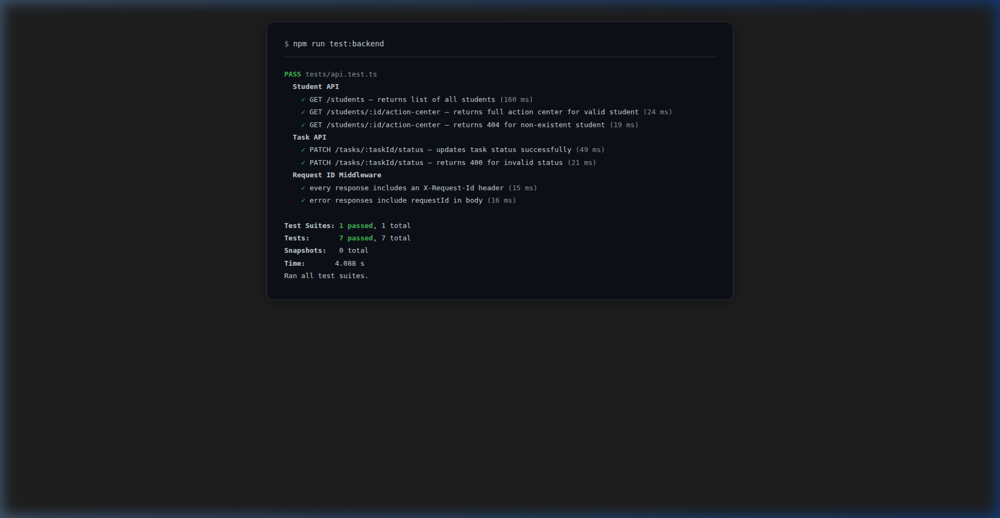
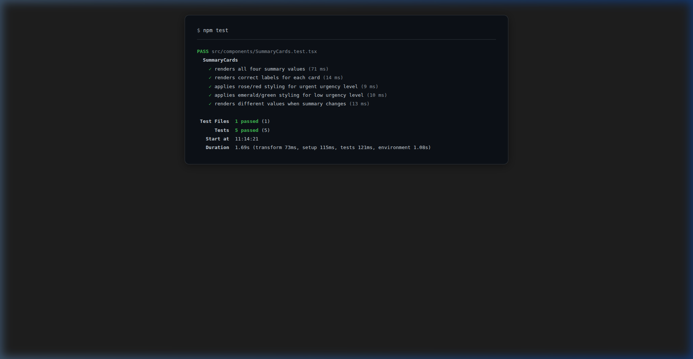

# Counselor-Student Action Center

A lightweight full-stack dashboard designed for educational counselors to monitor student progress, manage tasks, track unread messages, and identify urgent situations. Built using **React, TypeScript, Vite** on the frontend and **Node.js, Express, TypeScript** on the backend.

---

## 🏗️ Architecture Note

The project follows a clean separation of concerns and maintains type safety across the frontend and backend.

### Backend Structure

The backend is organized using a layered architecture:

* **Routes (`/routes`)**

  * Defines API endpoints and maps requests to controllers.

* **Controllers (`/controllers`)**

  * Handles HTTP requests and responses.
  * Performs request validation and delegates logic to services.

* **Services (`/services`)**

  * Contains business logic.
  * Handles task status updates and urgency calculations.

* **Data (`/data`)**

  * Stores mock student, task, and message data.
  * Simulates a database using TypeScript models.

* **Middleware (`/middleware`)**

  * Centralized error handling and request processing.

### Frontend Structure

* **Pages & Components**

  * Reusable UI components for student profiles, tasks, messages, and summary cards.

* **Custom Hooks**

  * Encapsulates data fetching and state management.
  * Keeps UI components focused on rendering.

### Data Flow

1. User selects a student.
2. Frontend requests student action center data.
3. Backend returns student profile, tasks, messages, and summary information.
4. User updates task status.
5. Frontend sends a PATCH request.
6. Backend updates the task and returns the updated data.

---

## 📝 API Contract

### 1. Get All Students

**Endpoint**

```http
GET /api/students
```

**Response**

```json
[
  {
    "id": "student_1",
    "name": "Jane Doe"
  }
]
```

---

### 2. Get Student Action Center

**Endpoint**

```http
GET /api/students/:id/action-center
```

**Response**

```json
{
  "student": {
    "id": "student_1",
    "name": "Jane Doe"
  },
  "tasks": [
    {
      "id": "task_1",
      "studentId": "student_1",
      "title": "Submit Statement of Purpose",
      "status": "todo",
      "priority": "high",
      "updatedAt": "2026-06-01T12:00:00.000Z"
    }
  ],
  "messages": [
    {
      "id": "msg_1",
      "studentId": "student_1",
      "content": "Hello Counselor, please review my documents.",
      "read": false
    }
  ],
  "summary": {
    "totalTasks": 1,
    "completedTasks": 0,
    "unreadMessages": 1,
    "urgencyLevel": "high"
  }
}
```

---

### 3. Update Task Status

**Endpoint**

```http
PATCH /api/tasks/:taskId/status
```

**Request Body**

```json
{
  "status": "completed"
}
```

**Response**

```json
{
  "id": "task_1",
  "studentId": "student_1",
  "title": "Submit Statement of Purpose",
  "status": "completed",
  "priority": "high",
  "updatedAt": "2026-06-01T23:38:00.000Z"
}
```

---

## 🚀 Setup & Run Instructions

### Prerequisites

* Node.js 18+
* npm

---

### 1. Clone the Repository

```bash
git clone https://github.com/suryaKumar2408/counselor-student-action-center.git
cd counselor-student-action-center
```

---

### 2. Backend Setup

```bash
cd backend

npm install

npm run dev
```

Backend runs on:

```text
http://localhost:5000
```

---

### 3. Frontend Setup

Open a new terminal and run:

```bash
cd frontend

npm install

npm run dev
```

Frontend runs on:

```text
http://localhost:5173
```

---

### 4. Running Tests

#### Backend Tests (Jest + Supertest)

```bash
cd backend
npm test
```

Runs 7 integration tests covering all API endpoints, error cases, and request ID middleware.

<details>
<summary>✅ Backend test output (click to expand)</summary>

```
PASS tests/api.test.ts
  Student API
    ✓ GET /students — returns list of all students (160 ms)
    ✓ GET /students/:id/action-center — returns full action center for valid student (24 ms)
    ✓ GET /students/:id/action-center — returns 404 for non-existent student (19 ms)
  Task API
    ✓ PATCH /tasks/:taskId/status — updates task status successfully (49 ms)
    ✓ PATCH /tasks/:taskId/status — returns 400 for invalid status (21 ms)
  Request ID Middleware
    ✓ every response includes an X-Request-Id header (15 ms)
    ✓ error responses include requestId in body (16 ms)

Test Suites: 1 passed, 1 total
Tests:       7 passed, 7 total
Snapshots:   0 total
Time:        4.088 s
Ran all test suites.
```

</details>

#### Frontend Tests (Vitest + React Testing Library)

```bash
cd frontend
npm test
```

Runs 5 component tests verifying the SummaryCards rendering, labels, and urgency-level styling.

<details>
<summary>✅ Frontend test output (click to expand)</summary>

```
 ✓ src/components/SummaryCards.test.tsx (5 tests) 121ms
   ✓ SummaryCards (5)
     ✓ renders all four summary values 71ms
     ✓ renders correct labels for each card 14ms
     ✓ applies rose/red styling for urgent urgency level 9ms
     ✓ applies emerald/green styling for low urgency level 10ms
     ✓ renders different values when summary changes 13ms

 Test Files  1 passed (1)
      Tests  5 passed (5)
   Duration  1.69s
```

</details>

---

## 🧪 Test Results

### Backend Tests (Jest + Supertest) — 7/7 Passed



### Frontend Tests (Vitest + React Testing Library) — 5/5 Passed



---

## ✨ Features

* Student profile summary
* Task management dashboard
* Unread message tracking
* Dynamic urgency indicators
* Task status updates
* Student switching
* Responsive UI
* Type-safe API integration

---

## 🔍 Technical Decisions

### Request Logging

Every incoming request is logged on response completion using `res.on('finish')`. Log format:

```
[2026-06-01T18:39:09.799Z] GET /students 200 (req-id: 1400abdb-81b0-455a-8682-25863b2beaaf)
```

**Why `console.log`?** The project already uses `console` throughout. Adding a logging library (Winston, Pino) would introduce unnecessary dependency overhead for a mock-data application. If the project scales to a real database, swapping to a structured logger is a one-line change since the middleware is isolated.

### Request IDs

A UUID v4 is generated per request via `crypto.randomUUID()` (built-in, zero dependencies). The ID is:
- Set as the `X-Request-Id` response header for client-side correlation.
- Included in all error response bodies (`requestId` field).
- Logged alongside every request and error for traceability.

**Tradeoff:** If a client sends an `x-request-id` header, it is reused instead of generating a new one. This supports distributed tracing across services but assumes trusted clients. For untrusted environments, the middleware can be changed to always generate a new ID.

### Testing Approach

| Layer | Tool | Why |
|-------|------|-----|
| Backend | Jest + Supertest | Industry standard for Express integration testing. Supertest sends real HTTP requests against the Express app without starting a server. |
| Frontend | Vitest + React Testing Library | Vitest is Vite-native (zero extra config), shares the same transform pipeline. Testing Library encourages testing user-visible behavior over implementation details. |

**What's tested:**
- **Backend:** All 3 API endpoints (happy + error paths), request ID header presence, and request ID in error bodies.
- **Frontend:** SummaryCards component — a pure presentational component tested with different data inputs and urgency-level styling assertions.

**Why SummaryCards?** It's the best candidate for a first test: pure props-in/render-out with no API calls or side effects, and it has conditional styling logic (urgency levels) worth verifying.

### Performance Considerations

- **Logging middleware** uses `res.on('finish')` instead of `res.on('close')` — `finish` fires when the response is fully written but before the socket closes, avoiding timing issues.
- **Request ID generation** uses Node's built-in `crypto.randomUUID()` which is backed by OpenSSL and is fast enough for per-request usage (~0.01ms per call).
- **No runtime dependencies added** — all new packages (`jest`, `supertest`, `vitest`, `@testing-library/*`) are dev-only.

---

## 🛠️ Tech Stack

### Frontend

* React
* TypeScript
* Vite
* Tailwind CSS

### Backend

* Node.js
* Express
* TypeScript

---

## 🌐 Deployment

* Frontend: Vercel
* Backend: Render
